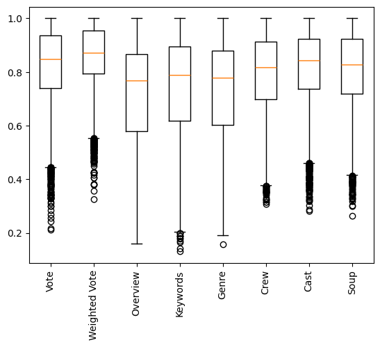

# Content-based Filtering

Content-based filtering aims to recommend items based on the characteristics of the items themselves. For a given user, we try to recommend them items which are similar to the items they like. In this example, we might recommend "The Dark Knight Rises" and "Inception" to someone who has highly rated "Batman Begins" and "Inception". This recommendation is based on insight into the movies. This insight can be gained from various features about the movies.

## Popularity-based Recommenders
The `movie_metadata.csv` file has two fields of that allude to the popularity of the movies `vote_average` and `vote_count`. We could simply rank the movies by their `vote_average` which is basically their average rating. However, there might be some movies which have a high rating with a very small amount of votes. To mitigate this we can use a weighted rating:

$$
\textit{WR} = (v / (v + m) * r) + (m / (v + m) * c)
$$

Here, $v$ is the `vote_count`, $r$ is the `vote_average`, $m$ is the 90% quantile of the `vote_count`, $c$ is the `vote_average`. This scheme tempers the previously stated effect.

## Similarity-based Recommenders
Instead of simply looking at how popular the movies are, we can also take a peek at their contents. Using these features, if we can get a measure of similarity between the movies the user has already rated and the rest of the movies. Then we can weight each of these similarities with the user's ratings to get an estimated ordering on the movies we want to recommend to the user.

This measure of similarity is quite straightforward for say something like the `genres` field where we can simply one-hot encode the genres and use cosine similarity to compare the movies. For other fields like say the `keywords` field, its more complicated. For fields like this with a large number of categories like `crew` and `cast`, one-hot encoding these features can get cumbersome. We can concatenate all the category names into a long string and use the `CountVectorizer` in `scikit-learn` to get a matrix representing the presence of all the categories in the movies. After this we can use cosine similarity to compare two movies.

Of course, we don't have to restrict ourselves to just a singular features. Since all the features are converted into strings, we can concatenate all of these into a single "soup" features and use the same method on this engineered feature.

## Text Similarity-based Recommenders
An interesting feature in the metadata is the movie `overview`. This actually just contains text. We could remove all the stop words and perform stemming to reduce similar words but just comparing frequency of various words in the overview is not enough. We need a measure of importance for the words. TF-IDF (term frequency–inverse document frequency) is the perfect candidate for this job.

## Comparison

Surprisingly, just recommending popular movies seems to be the best performing approach. The overview field shows a lot of promise but it doesn't contain enough text for TF-IDF to do its magic. To truly get the most of this feature, we need a much more sophisticated way to extract the insight contained in the overview. Another interesting observation is that, all the similarity based rankers don't perform as well. A problem with the keywords and genre fields is that they cast the net too wide. In the future, instead of using these fields to rank the movies, we could use them to narrow down the search space and then use a more expensive but powerful technique to determine the final ranks.

